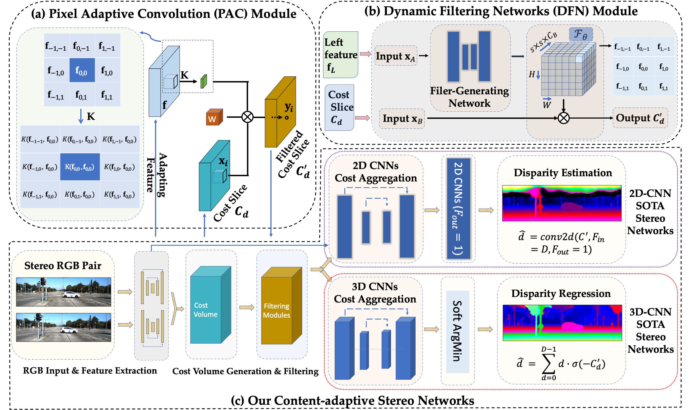
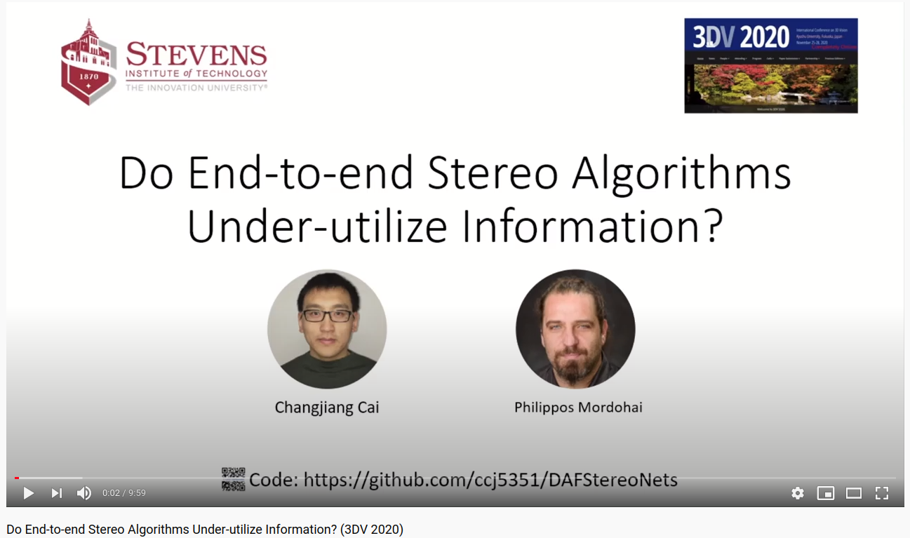
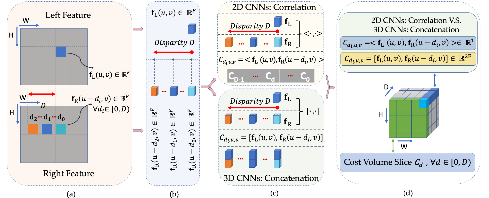

# Do End-to-end Stereo Algorithms Under-utilize Information? (DAF-StereoNets)

This is a work by [Changjiang Cai](https://www.changjiangcai.com) and [Philippos Mordohai](https://mordohai.github.io/) - 3DV 2020

See the links: [**arXiv**](https://arxiv.org/abs/2010.07350), [**Slides**](https://github.com/ccj5351/DAFStereoNets/blob/master/files/daf-stereo-10mins-final.pdf), [**Poster**](https://github.com/ccj5351/DAFStereoNets/blob/master/files/poster-daf.pdf), [**Conf-Proceeding**](https://github.com/ccj5351/DAFStereoNets/blob/master/files/daf-stereo-3dv-conf20-pub.pdf)

<p align="center">

</p>


---

Please check our presentation video as shown below:

<p align="center">
  <a href="https://youtu.be/jarA_fj9z18">
  
  </a>
</p>

---


## Introduction
We propose Deep Adaptive Filtering (DAF) Stereo Networks, DAF-StereoNets for short. Our network can leverage image context as a signal to dynamically guide the matching process. In particular, we integrate four deep adaptive or guided filters into four existing 2D or 3D convolutional stereo networks. 

Those four deep adaptive or guided filters include:
- segmentation-aware bilateral filtering (SABF)
- dynamic filtering networks (DFN)
- pixel adaptive convolution (PAC)
- semi-global aggregation (SGA)

And they are incorporated into four state-of-the-art deep stereo architectures, including:
- DispNetC (2D CNNs)
- GCNet (3D CNNs)
- PSMNet (3D CNNs)
- GANet (3D CNNs)

### Cost Volume in SOTA Deep Stereo Matching
End-to-end stereo matching methods can be generally grouped into two categories: 
2D CNNs for correlation-based (i.e., generating a 3D cost volume with dimension DxHxW) 
disparity estimation and 3DCNNs for cost volume (i.e., generating a 4D cost volume with 
dimension FxDxHxW) based disparity regression.
The following figure demonstrates the cost volume in 2D and 3D CNNs for stereo matching.

<p align="center">

</p>

## Building Requirements

The following shows our setup succefully run in our experiments (N.B. older or later versions might work, but we do not test).  

```
GPU: Titan XP (12GB) or Titan RTX (24GB) 
pytorch: >=1.2.0
cuda: >=10.0
Other commonly used Python Lib: e.g., Numpy, Matplotlib, Cython etc (Check the code for details)
Verified platform/settings: ubuntu 16.04 (or 18.04) + cuda 10.0 + python 3.7 (or 3.5)
```

## How to Use?

Assuming this repository is located at `~/DAFStereoNets` (definitely you can put it anywhere you prefer), with Ubuntu 18.04 OS and Python 3.7.

1. (Optional) Compile the code to generate the libraries (with the help of Boost-Python) which are used to calcuate bad-x error metrics to evaluate disparity maps:

   ```bash
   cd ~/DAFStereoNets/src/cpp
   # check the CMakeLists.txt for the details;
   mkdir build && cd build
   cmake .. && make
   ```

   This will generate the libraries `libeth3d_2_view_evaluate.so`, `libevaldisp_mbv3.so`, `libevaluate_stereo_training.so`  and `libpfmIO.so`, which you can see at `~/DAFStereoNets/src/cpp/lib` directory.

2. (Optional) Compile the libraries which are used to generate KITTI-color-style disparity maps and disparity error maps, both of which are used by our PyTorch codes to generate summary images for Tensorboard visualization to monitor the network training.
   ```bash
   cd ~/DAFStereoNets/src/cython
   # check the compile.sh file for the details;
   sh ./compile.sh
   ```
   This will generate the libraries, e.g., `writeKT15ErrorLogColor.cpython-37m-x86_64-linux-gnu.so`  and `writeKT15FalseColorcpython-37m-x86_64-linux-gnu.so` (Please note that here `*-37m-*` means Python 3.7, and you might get different names depending on your system), located at `~/MS-Nets/src/cython` directory.

3. Training, Evaluation and Testing:
   - See the main bash file `do_main_attenStereoNet.sh` for more details.
   - More experiments can be executed to run the bash files under directory `~/MS-Nets/abalation_runfiles`.

## Pretrained Models
 - Coming soon ...

## Results
 - Coming soon ...

## Reference:

- If you find the code useful, please cite our paper:

``` 
@inproceedings{cai2020deep_adaptive_stereo,
    title={Do End-to-end Stereo Algorithms Under-utilize Information?}, 
	 author={Changjiang Cai and Philippos Mordohai},
    booktitle={2020 International Conference on 3D Vision (3DV)}, 
    year={2020},
    pages={374-383},
    doi={10.1109/3DV50981.2020.00047}
  }
```

- Or the arXiv version.

```
@misc{cai2020deep_adaptive_stereo,
   title={Do End-to-end Stereo Algorithms Under-utilize Information?}, 
	author={Changjiang Cai and Philippos Mordohai},
	year={2020},
	eprint={2010.07350},
	archivePrefix={arXiv},
	primaryClass={cs.CV}
}
```


## Contact

Changjiang Cai, Email: changjiangcai2020 AT Gmail or hit my [homepage](https://www.changjiangcai.com/).